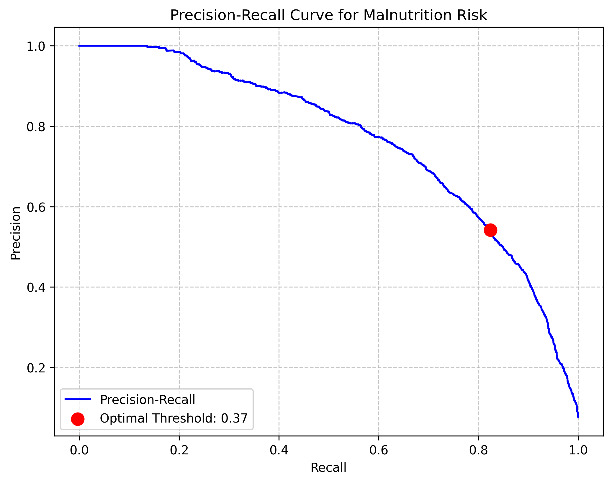
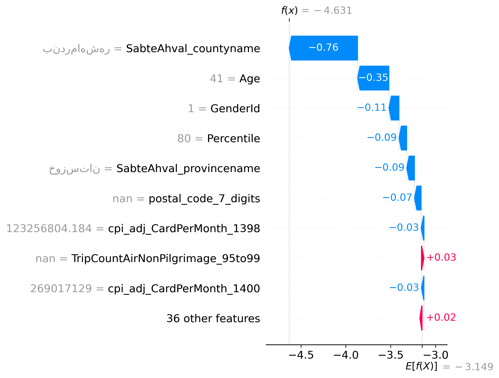
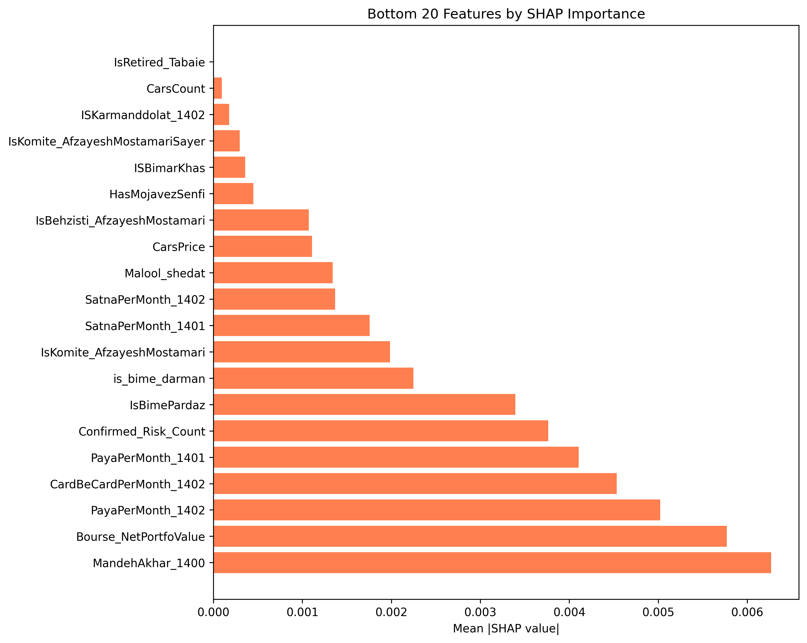

# Malnutrition Risk Prediction

The aim of this project is to predict whether individuals are at risk of malnutrition based on the financial, socio-economic, and geographical data of 1.7 million individuals. Social workers and welfare agencies can use the model output to identify those individuals and act accordingly.

`LightGBM` · `scikit-learn` · `Hydra` · `Optuna` · `MLflow` · `SHAP` · `skops` · `uv` · `Make` 


## The problem

Malnutrition is normally recorded after a clinical encounter, which means the condition already exists by the time anyone knows about it. Meanwhile welfare agencies already hold population-wide administrative data (income, bank transfers, assets, insurance status, geography) that was collected for completely different purposes.

This project asks whether that data can be turned into a screening signal instead. Given a household's financial and demographic footprint, how likely is it to contain a malnutrition case? The output is a ranked risk score meant to prioritise limited caseworker capacity, not a clinical diagnosis.

### How I defined the target

The clinical label is only observed for a subset of the population, so I defined the modelling target at the household level:

> A household is positive if any member has a recorded malnutrition case, and that label is propagated to every member of the household.

Here I adopt an ontological assumption: malnutrition is a household-level condition emerging from shared environmental, economic, and behavioural factors, rather than an isolated individual event. This assumption does a lot of work in the rest of the project. It makes the household, not the individual, the unit of inference, and that in turn decides how the data has to be split.

After propagation, 7.6% of rows are positive.

### Class imbalance and how I addressed it

Malnutrition is a relatively rare condition and this is true for the dataset as well. Class imbalance is addressed in three different places in the project:

1. **Data splitting.** The data must be split with stratification, otherwise we might end up with splits that contain no or very few malnutrition cases. In addition to that, the household-level assumption above means individuals from the same household must always land in the same split or fold, otherwise relatives end up on both sides of the boundary and every score is inflated by leakage. I used scikit-learn's `StratifiedGroupKFold` with some tweaks: it is grouped on household ID and stratified on whether the household contains at least one positive case, and unlabelled households are routed through `GroupShuffleSplit`. (See the "How the project works" section for more details.)

2. **Evaluation metrics.** ROC-AUC and accuracy are not a good representation of the model's performance here, so instead I rely on PR-AUC (average precision) for tuning and model selection, and on F-beta for choosing the operating threshold. The Results section shows how far apart ROC-AUC and PR-AUC actually end up.

3. **Model tuning.** Malnutrition cases are assigned a heavier penalty during the hyperparameter search.

### Inflation

One more problem is specific to this data rather than to the imbalance. Iran has had sustained high inflation, so a rial amount recorded in 1398 is not comparable to the same nominal amount in 1402. If I leave the monetary features alone they encode time as much as they encode wealth. I deflate them using the provincial CPI series published by the Statistical Center of Iran, joined per province and year.


## Results

I trained LightGBM and tuned it with Optuna against cross-validated PR-AUC. The numbers below come from a held-out set of 29,782 individuals containing 2,268 positive cases, so prevalence is 7.62%.

| Metric | Value | Reference |
| --- | --- | --- |
| **PR-AUC** (primary) | **0.765** | 0.076 for a random ranker, so a 10.0× lift |
| ROC-AUC | 0.957 | 0.500 for a random ranker |
| Operating threshold (F2-optimal) | 0.371 | |
| Precision at threshold | 0.542 | 0.076 if we flagged at random, so a 7.1× lift |
| Recall at threshold | 0.824 | |
| F2 | 0.746 | |

| | Predicted at risk | Predicted not at risk |
| --- | --- | --- |
| **Actually at risk** | 1,869 (82.4% caught) | 399 (17.6% missed) |
| **Actually not at risk** | 1,582 (5.7% false alarm rate) | 25,932 (94.3% correctly cleared) |

### Reading the operating point

The question in deployment is not "is this individual malnourished". It is "who should a caseworker visit first, given that capacity is finite". Read that way:

- Reviewing 11.6% of the cohort surfaces 82.4% of the true cases.
- Of every 100 people flagged, about 54 are genuine cases, against 8 if we picked at random.
- 399 cases (17.6%) are still missed at this threshold, and that is the price being paid for the recall.

The threshold sits at 0.371 rather than 0.5 because I select it by maximising F-beta with β = 2, which weights recall four times as heavily as precision. Missing an at-risk child is worse than a wasted home visit. Moving the threshold up the curve trades recall back for precision, so the operating point can be re-tuned to whatever caseworker capacity actually exists without retraining anything.




### What the model actually uses

Every evaluation run writes SHAP attributions, both as a global ranking and as per-row explanations. When I grouped all 45 features by family, the global picture turned out to be very concentrated.


| Feature family | Features | Share of total mean \|SHAP\| |
| --- | --- | --- |
| Demographic and geographic | 5 | **78.8%** |
| Travel | 3 | 5.0% |
| Welfare rank (decile, percentile) | 2 | 4.1% |
| Financial, banking, and assets | 35 | **12.1%** |


The beeswarm also shows direction and not just magnitude. Two readings are unambiguous:

- Low `Age` pushes strongly towards higher predicted risk, and it is the widest positive excursion on the plot at roughly +4.7 in log-odds.
- Higher non-pilgrimage air travel counts push towards lower risk, which is the sign I would expect, since discretionary air travel is a reasonable proxy for disposable income.

### Per-row explanations

Attributions are computed per row, so any individual prediction can be decomposed and handed to a caseworker as a rationale instead of a bare score.



For this individual the model moves from a baseline of −3.149 log-odds (4.1% predicted risk) down to −4.631, which is 1.0% predicted risk, so the odds shift by a factor of 0.23. County of residence supplies 51% of that movement and age supplies another 24%. The ten displayed contributions sum to −1.48 against an actual shift of −1.482, which confirms that SHAP's additivity property holds and that the explanation is faithful to the model rather than an approximation of it.

> Note: Persian place-name labels render right-to-left reversed in matplotlib. The attributions themselves are correct and only the glyph ordering in the axis labels is affected.

### Features the model never uses

The evaluation also writes out the bottom of the ranking, which is where the pruning candidates are.



29 of the 45 features fall below 0.01 mean |SHAP|, and the bottom 20 together account for 1.9% of the total attribution. `IsRetired_Tabaie` scores exactly 0.0, which means LightGBM never split on it even once, so under this feature set it carries no information at all.


## The data

The curated dataset holds 1,697,816 individuals and 48 columns. Each row is an individual, and `Parent_Id` (the head-of-household ID) is the household key.

One structural detail matters for how the features should be read: not every column is an individual attribute. Banking, income, assets, travel, disability, insurance, and employment fields vary per person, but welfare decile and percentile, postal code, urban/rural status, and province and county are household attributes that get replicated onto every member's row.

| Group | Features |
| --- | --- |
| Demographics | Age, gender, postal code, county, province, urban/rural |
| Welfare indicators | Decile, percentile (national welfare ranking) |
| Assets | Equity shares, vehicle count and value, stock portfolio value |
| Employment and benefits | Government employee, retiree status, guild license |
| Health | Special diseases, disability status and severity |
| Support programs | Welfare organisation coverage (Behzisti, Komite Emdad) |
| Insurance | Health insurance, insurance payer status |
| Financial transactions | Card purchases, card-to-card transfers, Paya and Satna transfers, monthly averages for 1398 to 1402 |
| Travel | Air and non-air trips, pilgrimage and non-pilgrimage, 1395 to 1399 |
| Banking | Deposits, opening and closing account balances, 1399 to 1400 |
| Income | Registered income |


## How the project works

The project splits into a data preparation phase and a modelling pipeline. I kept that boundary deliberate: preparation is a deterministic rebuild of the dataset, while everything that learns parameters from data lives inside a single fitted scikit-learn `Pipeline`. Any new raw extract has to pass through preparation before it can reach the model.


### 1. Feature engineering

Beyond the mechanical transformations, two domain-driven features carry most of the intent:

- **CPI adjustment.** The monetary features are deflated to comparable terms as described above, resolved per province and year, which is the granularity the dataset actually supports.
- **Vulnerability index.** A composite feature I derive from health status, disability, age, economic percentile, and health insurance coverage.

### 2. Preprocessing

This step covers imputation, scaling, categorical encoding, and target encoding for high-cardinality categoricals like county and postal code. It mostly matters for non-tree models such as logistic regression, since tree models need no scaling and LightGBM handles missing values and high-cardinality categoricals natively. That is why I made the preprocessor a swappable configuration axis rather than a fixed stage.

### 3. Training and hyperparameter optimisation

Optuna tunes the model under cross-validation and optimises PR-AUC. Each run writes to a directory keyed by its configuration and timestamp:

```
outputs/experiments/<feature_engineering>/<preprocessor>/<model>/<YYYY-MM-DD_HH-MM-SS>/
```

With this path configuration each experiment tree describes itself and two runs can never silently overwrite each other. Alongside the serialised model, each run directory keeps its best and effective parameters, metrics, the full optimisation history, a job log, and `mlflow_run.json`, which is the pointer that ties the directory back to its MLflow run.

### 4. Evaluation

A trained run is scored on held-out data: PR-AUC and ROC-AUC, F-beta-optimal threshold selection with the resulting precision and recall trade-off, precision-recall curves, scored predictions, and SHAP explanations for global and local attribution.

Evaluation output is written inside the run directory it evaluates, under `evaluations/<timestamp>/`. That way a set of metrics can never be orphaned from the model that produced it, and I can re-evaluate the same run later without overwriting earlier results.

### 5. Promotion

Training logs runs but never registers them. Moving a model into the MLflow Model Registry is a separate and deliberate action: `promote.py` reads `mlflow_run.json` from a run directory to recover the model URI, registers it under a name, and assigns an alias.

```bash
uv run orchestration/promote.py \
  promote.run_dir=outputs/experiments/base/tree/lightgbm/2026-07-31_18-48-50 \
  promote.name=malnutrition_risk promote.alias=champion
```

Keeping registration off the training path means the registry reflects decisions rather than run history.

---

## Configuration and reproducibility

- **Hydra** composes every run from configuration groups (`model`, `preprocessor`, `feature_engineering`, `training`, `data_prep`, `search_space`), so a new experiment is a command-line override instead of a code change.
- **MLflow** tracks runs against a local SQLite backend, and the tracking URI can be overridden by environment variable so the project moves between machines cleanly.
- **Optuna** persists its studies to SQLite, and a `study_version` knob forces a clean study when the search space changes.
- **uv** pins the full dependency graph in `uv.lock` against a fixed Python version, so a fresh clone reproduces the same environment.

---

## Getting started

### Setup

You need [uv](https://docs.astral.sh/uv/). Install it and then restart your terminal, and your IDE too if you use its built-in terminal, since it caches `PATH` at launch.

```bash
# macOS / Linux
curl -LsSf https://astral.sh/uv/install.sh | sh

# Windows
powershell -ExecutionPolicy ByPass -c "irm https://astral.sh/uv/install.ps1 | iex"
```

Then from the project root:

```bash
make setup
```

### Commands

Every stage is exposed through `make`, and `make help` prints the same list at the terminal.

| Target | Description |
| --- | --- |
| `make setup` | Sync the environment from `uv.lock` |
| `make curate` | Build the curated dataset from raw data |
| `make split` | Produce train / validation / test splits |
| `make train` | Train and tune a model |
| `make train-quick` | Fast smoke-test training run |
| `make evaluate` | Evaluate a trained run |
| `make mlflow-ui` | Launch the MLflow tracking UI |
| `make optuna-ui` | Launch the Optuna dashboard |

A full pass from raw data to scored results:

```bash
make setup && make curate && make split && make train && make evaluate
```

`make train` records its output directory in `outputs/last_run.txt` and `make evaluate` reads that pointer automatically, so the common case needs no arguments and pinning an older run is still a one-liner.

### Overrides

Behaviour is controlled by variables rather than by editing the Makefile:

| Variable | Default | Purpose |
| --- | --- | --- |
| `TRAIN_OVERRIDES` | | Hydra overrides forwarded to `orchestration/train.py` |
| `EVAL_OVERRIDES` | | Hydra overrides forwarded to `orchestration/evaluate.py` |
| `RUN_DIR` | contents of `outputs/last_run.txt` | Pin evaluation to a specific run directory |
| `MLFLOW_URI` | `sqlite:///mlflow_db/malnutrition.sqlite` | MLflow backend store |
| `OPTUNA_URI` | `sqlite:///mlflow_db/optuna.db` | Optuna study storage |

```bash
# Swap the model and preprocessor, widen the search, and start a fresh Optuna study
make train TRAIN_OVERRIDES="model=logistic_regression preprocessor=classic training.n_trials=50 optuna.study_version=3"

# Evaluate a specific historical run
make evaluate RUN_DIR=outputs/experiments/base/tree/lightgbm/2026-07-31_18-48-50
```
